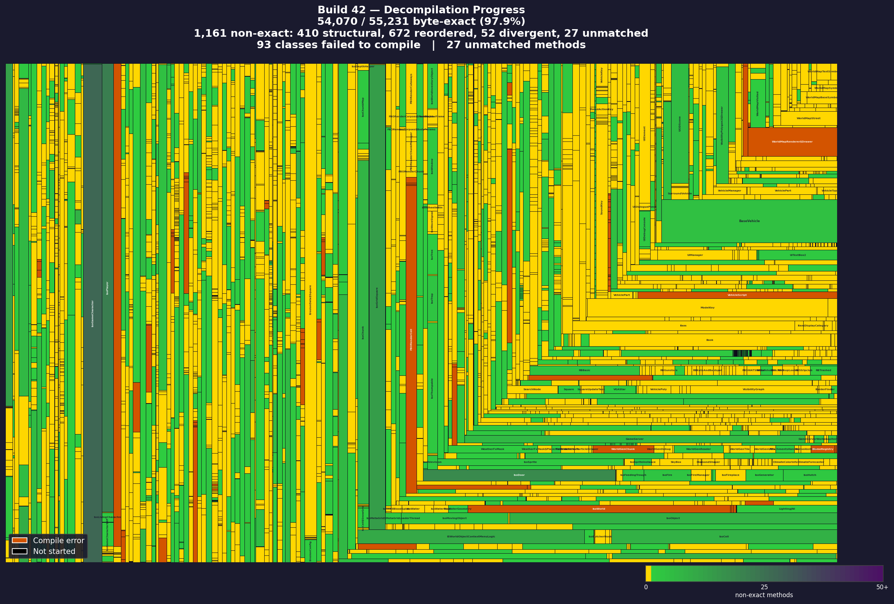

# Zomboid Decompiler
Simplified decompilation tool for Project Zomboid powered by a [custom fork of Vineflower](https://github.com/jaidaken/vineflower-zomboid).

## Decompilation Progress

### Build 41


### Build 42


## The Vineflower Fork

This project uses a [custom fork of Vineflower](https://github.com/jaidaken/vineflower-zomboid) — the Java decompiler — with extensive modifications for **roundtrip fidelity (RTF)**. The goal: decompile Project Zomboid, recompile the source with the same JDK, and get bytecode that matches the original as closely as possible.

### Why fork Vineflower?

Upstream Vineflower applies cosmetic transformations that improve readability but change the bytecode:
- Negating `if` conditions to produce guard clauses (changes branch direction)
- Collapsing `if/else return` into ternary operators (changes stack layout)
- Simplifying `x = x + y` into `x += y` (changes bytecode instruction)
- Reordering switch cases (changes tableswitch/lookupswitch layout)
- Folding prefix/postfix increment expressions (changes evaluation order)

These make the source cleaner to read, but when you recompile, the bytecode is different. For modding PZ — where you need to patch specific methods and have the rest match the original — this is a problem.

### What RTF mode does

The `roundtrip-fidelity` (`-rtf=1`) option preserves original bytecode patterns:

| Feature | Standard Vineflower | RTF Mode |
|---------|-------------------|----------|
| Branch direction | Negates for readability | Preserves original `if/goto` layout |
| Switch case order | Sorted for readability | Preserves bytecode order |
| Compound assignment | `x += y` | `x = x + y` (matches bytecode) |
| Prefix/postfix | Simplified `i++` | Preserves original form |
| Return ternary | `return cond ? a : b` | `if/else return` (matches bytecode) |
| Widening casts | Removed if implicit | Preserved (`(double)floatVal`) |
| LVT types | Inferred | Pinned from Local Variable Table |

### Fork changes beyond RTF guards

The fork includes fixes to make RTF output actually compile:

- **Dead code suppression** — RTF's branch preservation can leave bytecode-level dead code (after unconditional `goto`) that javac rejects as "unreachable statement". The rendering layer detects and suppresses these unreachable siblings.
- **Variable initialization** — When the decompiler's control flow restructuring creates paths where Java's definite assignment analysis can't prove a variable is initialized, reference types get `= null` and primitives get `= 0`/`= 0.0`/`= false`.
- **Switch fall-through analysis** — Correct handling of unsimplified string-switch patterns (hashCode + byte0 switches) in dead code detection and return analysis.
- **Try-finally return analysis** — Proper handling of `CatchAllStatement` (try-finally) where the finally handler doesn't need to return — only the try body is checked.
- **Static final field handling** — When `<clinit>` decompilation fails to produce an initializer for a static final field, the `final` modifier is suppressed to avoid compilation errors.
- **Loop increment preservation** — `cleanUpUnreachableBlocks` in `ExitHelper` uses `hasEffectiveBasicSuccEdge()` to prevent incorrect deletion of loop increments after `integrateExits` creates wrapper SequenceStatements.
- **TWR return variable inlining** — JDK 9+ try-with-resources temp return variables are inlined back into the try body.
- **Orphaned label repair** — Label edges whose closure isn't registered get repaired after all transformations complete.
- **POP+INVOKESTATIC qualifier validation** — Static method qualifiers from POP handling are validated against the declaring class.
- **Synthetic class RTF bypass** — RTF is disabled for `$N` inner classes (switch-map synthetics) to prevent `<unrepresentable>` errors.

## Differences from the original

This fork is based on [demiurgeQuantified/ZomboidDecompiler](https://github.com/demiurgeQuantified/ZomboidDecompiler) (v3.0.0) and adds:

### Post-decompilation source transforms
An engine that applies 71 targeted source transforms to fix decompilation output so it compiles cleanly. These fall into three categories:

| Category | Count | Description |
|----------|-------|-------------|
| **Vineflower-fixable** | 37 | Decompiler bugs that could be fixed in VF source (type inference, instanceof scope, overload resolution) |
| **Game-specific** | 22 | Bytecode-matching hacks for PZ-specific patterns (lambda ordering, synchronized return patterns, eval order) |
| **Java limitations** | 12 | Raw type / type erasure workarounds that can't be fixed in the decompiler |

The vineflower-fixable transforms are candidates for elimination as the fork improves. The game-specific hacks are permanent — they exist to make recompiled bytecode match the original, not to fix decompiler correctness.

### Bytecode verification framework
A `verify` CLI command that compares original bytecode against recompiled classes at the instruction level, with:
- Semantic normalization (DUP patterns, store-load-return, GOTO inlining, dead code stripping)
- Guard clause detection and condition inversion matching
- Label isomorphism and block-level structural comparison
- Fuzzy computation matching (multiset comparison of core operations)
- Match tier categorization: EXACT, STRUCTURAL, SORTED_MULTISET, FUZZY_COMPUTATION, CORE_OPS_ONLY, NONE
- JSON report output and progress treemap image generation

### Decompilation progress tracking
Visual treemap images showing per-class bytecode match status, with CI workflow integration for automated progress updates.

## Usage
### Windows
1) Install [Java 17](https://www.oracle.com/fr/java/technologies/downloads/) or above.
2) Download the latest .zip from [Releases](https://github.com/demiurgeQuantified/ZomboidDecompiler/releases/latest).
3) Extract the zip.
4) Navigate to `bin/` and run `ZomboidDecompiler.bat`.
5) Wait a few minutes for decompilation to complete. The black box will close when the program has finished.
   - If you receive an error about not being able to find the game directory, open your command line to the `bin` folder and execute ``ZomboidDecompiler.bat "PATH"``, replacing `PATH` with the path to your game installation's `ProjectZomboid` folder.
     - Example: ``ZomboidDecompiler.bat "D:\Program Files (x86)\Steam\steamapps\common\ProjectZomboid"``

The decompiled source code will be written to `output/`, along with the dependencies and game jar.

### Other
1) Install [Java 17](https://www.oracle.com/fr/java/technologies/downloads/) or above.
2) Download the latest .zip from [Releases](https://github.com/demiurgeQuantified/ZomboidDecompiler/releases/latest).
3) Extract the zip.
4) Open your command line to the `bin` folder and execute ``ZomboidDecompiler "PATH"``, replacing `PATH` with the path to your game installation's `ProjectZomboid` folder.
   - Example: ``ZomboidDecompiler "D:\Program Files (x86)\Steam\steamapps\common\ProjectZomboid"``
5) Wait a few minutes for decompilation to complete.
The decompiled source code will be written to `output/`, along with the dependencies and game jar.

## Features
- Single click game decompilation.
- Automatic gathering of game dependencies as decompilation context and for future recompilation.
- Renaming of function parameters using Rosetta data.
- Renaming of other variables according to type to enhance readability.
- Line number remapping for remote debugging.
- **Roundtrip fidelity mode** via custom Vineflower fork — preserves original bytecode patterns (branch direction, switch ordering, evaluation order) so recompiled code matches the original.
- **Post-decompilation source transforms** that automatically apply 71 fixes to Vineflower output to correct type inference errors, raw generic issues, cast disambiguation, instanceof scope escapes, switch expression problems, and bytecode-matching patterns.
- **Bytecode verification** that compares original bytecode against recompiled classes at the instruction level to validate decompilation accuracy.

## Bytecode Verification
The `verify` command compares original bytecode against recompiled classes to detect decompilation errors.

```bash
# Compare original JAR against recompiled classes directory
ZomboidDecompiler verify path/to/projectzomboid.jar path/to/recompiled-classes/

# With options
ZomboidDecompiler verify original.jar recompiled/ --semantic --verbose --context 10
```

**Options:**
| Option | Description |
|--------|-------------|
| `--class-pattern` | Class name pattern filter (default: `zombie.*`) |
| `--verbose` | Show all methods including matches |
| `--strict-vars` | Compare variable indices directly without normalization |
| `--context N` | Instructions to show around diffs (default: 5) |
| `--no-color` | Disable ANSI color output |
| `--summary-only` | Only show summary statistics |
| `--semantic` | Enable semantic normalization (DUP/store-load-return/GOTO) |
| `--json-report PATH` | Write a JSON report for progress image generation |

The `verifyBytecode` Gradle task is also available: `gradlew verifyBytecode`. Exit code 2 indicates mismatches were found.

### Standalone Transforms
The `TransformFiles` utility can apply post-decompilation transforms to an existing directory of decompiled source files without re-running the decompiler.

## Supported builds
This fork targets **Build 41** (Zulu JDK 17.0.1) and **Build 42** (Zulu JDK 25.0.1) of Project Zomboid. The post-decompilation transforms, Vineflower fork, and bytecode verification are maintained for both builds.

## Command Line Interface
Launch with ``-h`` or ``--help`` for information about command line parameters.

## Remote debugging
A basic guide on using ZomboidDecompiler for remote debugging is hosted [here](https://github.com/demiurgeQuantified/PZModdingGuides/blob/main/guides/RemoteDebugging.md).

## Building
ZomboidDecompiler can be built with `gradlew build`.
You can include Rosetta files in `src/main/resources/rosetta/` to be used as defaults when no rosetta directory is passed.
The standard binaries in Releases are built with the
[latest Rosetta data](https://github.com/PZ-Umbrella/pz-rosetta-source) included.

### Building with the Vineflower fork
The decompiler references the Vineflower JAR directly from `../vineflower/build/libs/vineflower-1.11.2.jar`. To rebuild after changing the fork:

```bash
# Build the Vineflower fork (requires JDK 17)
cd vineflower
./gradlew clean allJar
cp build/libs/vineflower-1.11.2+local.jar build/libs/vineflower-1.11.2.jar

# IMPORTANT: Force clean rebuild — Gradle caches JARs aggressively
cd ../ZomboidDecompiler
rm -rf build .gradle
./gradlew installDist

# Run the full pipeline
bash scripts/b41.sh all
```
