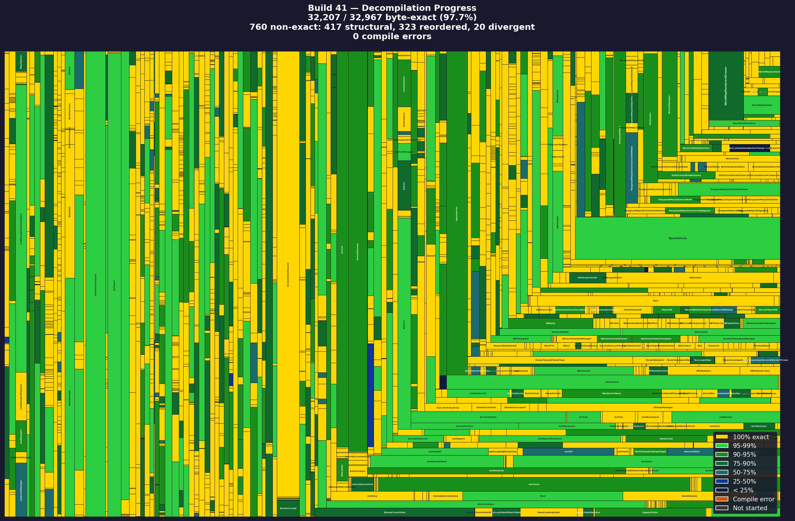

# Zomboid Decompiler

Bytecode-exact decompilation tool for Project Zomboid. Uses a [custom Vineflower fork](https://github.com/jaidaken/vineflower-zomboid) to decompile PZ, recompile with the same JDK, and verify the output matches the original bytecode instruction by instruction.

Forked from [demiurgeQuantified/ZomboidDecompiler](https://github.com/demiurgeQuantified/ZomboidDecompiler).

## Current status

### Build 41


| Metric | Value |
|--------|-------|
| EXACT match | 31,431 / 32,967 methods (95.3%) |
| Instruction match | 94.84% |
| Compile errors | 0 |
| NONE (unmatched) | 0 |
| Classes matched | 2,977 / 2,978 (99.97%) |

Match tier breakdown:

| Tier | Methods | Description |
|------|---------|-------------|
| EXACT | 31,431 | Identical normalized instructions + try-catch |
| STRUCTURAL | 613 | Same instructions, different label targets |
| SORTED_MULTISET | 807 | Same instructions as a set, different order |
| FUZZY_COMPUTATION | 104 | Core computations match |
| CORE_OPS_ONLY | 5 | Only invocations/field access match |
| NONE | 0 | No match at any tier |

## How it works

1. **Decompile** PZ bytecode using our Vineflower fork with RTF (Round-Trip Fidelity) mode
2. **Recompile** the decompiled source with the same JDK that compiled the original (Zulu 17.0.1)
3. **Verify** recompiled bytecode against the original, instruction by instruction

The point is to get decompiled source that recompiles to identical bytecode. Useful for PZ modding where you patch specific methods and need the rest to match the original.

## The Vineflower fork

The [custom Vineflower fork](https://github.com/jaidaken/vineflower-zomboid) adds RTF mode (`-rtf=1`) with these changes:

### RTF bytecode preservation

| Feature | Standard Vineflower | RTF Mode |
|---------|-------------------|----------|
| Branch direction | Negates for readability | Preserves original if/goto layout |
| Block ordering | javac default | Matches original bytecode offsets |
| Switch case order | Sorted for readability | Preserves bytecode order |
| Compound assignment | `x += y` | `x = x + y` (matches bytecode) |
| Prefix/postfix | Simplified `i++` | Preserves original form |
| Return ternary | `return cond ? a : b` | `if/else return` (matches bytecode) |
| Widening casts | Removed if implicit | Preserved (`(double)floatVal`) |
| LVT types | Inferred | Pinned from Local Variable Table |
| Pattern matching | `x instanceof Foo foo` | Explicit cast `(Foo)x` (avoids extra local vars) |
| Variable init | Always `= null`/`= 0` | Skipped when definitely assigned in all branches |

### RTF-specific fixes

- **Receiver-type casting** - emits `((InputStream)var).read()` when the bytecode receiver type differs from the variable's declared type
- **Orphaned anonymous class injection** - detects anonymous classes whose `.class` files exist but are never instantiated (dead code artifacts) and emits them to preserve `$N` numbering
- **Orphaned lambda emission** - emits synthetic `lambda$` methods that have no bootstrap reference (dead code from `if (false)` elimination)
- **Lambda ordering** - swaps if-else branches when lambda bytecode offsets would produce wrong `$N` numbering
- **Definite assignment analysis** - skips `= null`/`= 0`/`= 0.0` initializers when the variable is assigned in all branches before any read. Handles sequences, nested if-else, and chained assignments (`a = b = value`)
- **FinallyProcessor iinc fix** - includes `iinc` (opcode 132) in variable mapping during finally deinlining, fixing a bug where inlined finally copies with `iinc` on different variable slots couldn't be matched
- **Guard clause layout** - swaps if-else branches based on original bytecode offsets so javac's block layout matches the original
- **Dead code suppression**, **switch fall-through analysis**, **try-finally return analysis**, **orphaned label repair**, and various compilation bug fixes

## Differences from upstream

This fork adds 137 commits and ~13,000 lines beyond [demiurgeQuantified/ZomboidDecompiler](https://github.com/demiurgeQuantified/ZomboidDecompiler):

### Bytecode verification framework
A `verify` command that compares original bytecode against recompiled classes at the instruction level:
- Variable normalization (maps slot indices to encounter order)
- Multi-tier matching: EXACT, STRUCTURAL, SORTED_MULTISET, FUZZY_COMPUTATION, CORE_OPS_ONLY, NONE
- Semantic normalization (DUP patterns, store-load-return, GOTO inlining, guard clause detection)
- JSON report output and progress treemap image generation
- Mismatch categorization by root cause

### Full pipeline scripts
Automated decompile/recompile/verify pipelines for Build 41 and Build 42:
- Auto-rebuild when Vineflower source changes
- L-1 individual compilation fallback for cascade failure recovery
- Progress image generation (treemap visualization)

### PostDecompileTransforms (removed for B41)
B41 post-decompile transforms have been removed. All issues they worked around were fixed at the source in the Vineflower fork. B42 transforms still exist but are also disabled pending further Vineflower fixes.

## Usage

### Full pipeline (Build 41)
```bash
# Decompile + recompile + verify
./scripts/b41.sh

# Individual steps
./scripts/b41.sh decompile
./scripts/b41.sh recompile
./scripts/b41.sh verify
```

### Bytecode verification
```bash
ZomboidDecompiler verify path/to/projectzomboid path/to/recompiled-classes/

# With options
ZomboidDecompiler verify original/ recompiled/ --semantic --context 10 --json-report report.json
```

| Option | Description |
|--------|-------------|
| `--class-pattern` | Class name pattern filter (default: `zombie.*`) |
| `--verbose` | Show all methods including matches |
| `--strict-vars` | Compare variable indices without normalization |
| `--context N` | Instructions to show around diffs (default: 5) |
| `--semantic` | Enable semantic normalization |
| `--json-report PATH` | Write JSON report for progress image generation |

### Simple decompilation
For basic decompilation without verification:

**Windows:** Download from [Releases](https://github.com/jaidaken/ZomboidDecompiler/releases), extract, run `bin/ZomboidDecompiler.bat`.

**Linux/Mac:** `bin/ZomboidDecompiler "path/to/ProjectZomboid"`

Output goes to `output/` with dependencies and game jar.

## Building

### Prerequisites
- Java 17+ (Zulu JDK 17.0.1 recommended for bytecode-exact matching)
- The Vineflower fork cloned alongside this repo at `../vineflower/`

### Build from source
```bash
# Build Vineflower fork
cd vineflower
JAVA_HOME=/path/to/zulu17 ./gradlew clean allJar
cp build/libs/vineflower-1.11.2+local.jar build/libs/vineflower-1.11.2.jar

# Build ZomboidDecompiler (must use clean to avoid stale jar cache)
cd ../ZomboidDecompiler
./gradlew clean installDist

# Run full pipeline
./scripts/b41.sh
```

## Features
- Single-click game decompilation
- Automatic gathering of game dependencies for recompilation
- Parameter renaming using Rosetta data
- Variable renaming by type for readability
- Line number remapping for remote debugging
- Roundtrip fidelity mode via custom Vineflower fork
- Bytecode verification with multi-tier matching
- Progress tracking with treemap visualization

## Supported builds
- **Build 41** (Zulu JDK 17.0.1) - primary target, 94.84% instruction match
- **Build 42** (Zulu JDK 25.0.1) - supported

## Remote debugging
Guide: [PZModdingGuides/RemoteDebugging](https://github.com/demiurgeQuantified/PZModdingGuides/blob/main/guides/RemoteDebugging.md)
